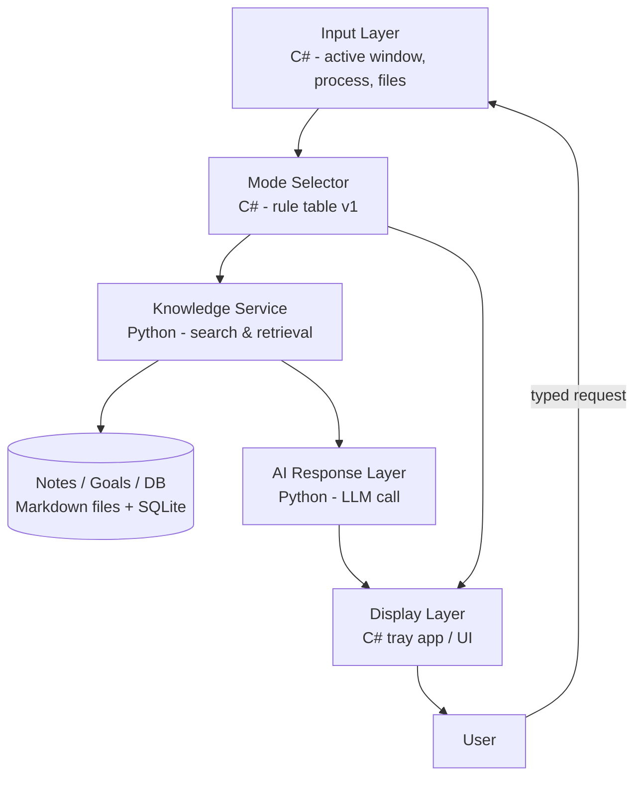

# Personal Context-Aware Assistant — Architecture & Roadmap (v0.1)

> Working base document. This will evolve as we build — treat it as a living plan, not a fixed spec.

## 1. Vision

A local, Windows-based assistant that quietly observes what you're doing (active app, files,
project context), automatically figures out which "mode" you're in, retrieves the most relevant
notes/goals/info from your own knowledge base, and gives you a fast, useful answer — without you
needing to manually search or remember where you put things.

## 2. Tech Stack Decision

Rather than spreading one stack across every job, each language is assigned to where it's
strongest. This also matches your learning goals (Python + TypeScript) without forcing them in
where they don't fit.

| Layer | Language / Tech | Why |
|---|---|---|
| **Core Engine** — active window/process detection, file watching, system tray app, orchestration | **C# / .NET** (WPF or WinUI) | You already know it. Best native access to Windows APIs (P/Invoke, `FileSystemWatcher`, UI Automation). This is the "always-on" backbone. |
| **Knowledge & AI Service** — search (keyword + later semantic), embeddings, response generation | **Python** (FastAPI, run as a local background service) | Best ecosystem for NLP/embeddings/LLM tooling (sentence-transformers, FAISS/Chroma, Ollama). This is where Python earns its place, not just decoration. |
| **UI / Dashboard** (deferred — Phase 4) | **TypeScript** (small WebView2 panel or Electron) | Good use of TypeScript later, once the core loop already works. Avoids front-loading complexity. |

**Communication:** C# engine ↔ Python service via simple local HTTP calls (`localhost:PORT`,
JSON in/out). Keeps each piece independently testable and replaceable.

## 3. High-Level Architecture



## 4. Data Layer Design

**Folder structure (proposal):**
```
/Assistant
  /Knowledge
    /Notes/*.md            ← general notes
    /Goals/goals.md         ← single tracked file, see format below
    /Important/important-info.md   ← evaluated/high-priority info
  /db/assistant.db          ← SQLite: file index, mode rules, tasks metadata
  /vector_index/            ← Phase 2+: embeddings index (Chroma/FAISS)
```

**Why both files *and* a database:** notes stay human-readable/editable in any text editor;
SQLite gives fast indexed lookup (which file, which mode, which evaluation level) without parsing
every file on every query.

**`goals.md` format (proposal):**
```markdown
## Goal: Learn Python fundamentals
- Status: In progress
- Progress: 40%
- Deadline: 2026-08-01
- Notes: focusing on basics + small FastAPI service
```

**`important-info.md` format (proposal):**
```markdown
## [P1] Server credentials location
Stored in password manager under "Assistant-Dev"
```
(`P1`–`P5` = evaluation/priority level — needs to be explicitly defined before coding starts.)

## 5. Mode System (v1 — rule-based, not ML)

Simple lookup table, no classifier needed yet:

| Active process / window contains | Mode |
|---|---|
| `devenv`, `Code.exe`, `*.cs`, `*.py` | Coding |
| `Outlook`, `Teams`, task-manager apps | Tasks/Deadlines |
| `OneNote`, `Notion`, browser + "notes" | Ideas |
| (no match) | General |

This can later be upgraded to embedding-based classification once you have enough real usage
data to justify it — not before.

## 6. Phased Roadmap

| Phase | Goal | Key deliverables |
|---|---|---|
| **0 — Foundation** | Prove the core loop works | C# console/tray app, SQLite schema, manual mode toggle, plain keyword search over `/Notes`. No AI yet. |
| **1 — Auto-detection** | Replace manual mode toggle | C# polls active window/process, applies rule table from §5 automatically. |
| **2 — Smarter search** | Add semantic search | Python FastAPI service: embeddings + Chroma/FAISS; C# calls it over HTTP for "search by meaning." |
| **3 — AI responses** | Real answers, not just raw notes | LLM call (local via Ollama, or API) composes a summary/answer from retrieved notes; goals % surfaced; important-info flagged. |
| **4 — UI polish** | Make it pleasant to use daily | Refined tray app; optional TypeScript dashboard; reminders/notifications. |

## 7. Open Decisions (need your input before coding starts)

1. **LLM source:** local model via Ollama (private, free, weaker on this hardware) vs. an API
   (better quality, costs money, needs internet). No wrong answer — depends on your priorities.
2. **Evaluation-level scale:** what does "evaluation level" mean concretely — a 1–5 priority? a
   confidence score? freshness/recency? This needs to be fixed before the DB schema is final.
3. **Note format:** plain markdown vs. markdown with metadata front-matter (tags, mode, level) —
   front-matter makes search/indexing easier but adds a bit of manual upkeep.

## 8. Suggested Next Step

Start with **Phase 0**: a minimal C# console app + SQLite + a folder of test notes + basic
keyword search. No window-detection, no AI, no UI polish — just prove "ask → search → answer"
works end to end. Everything else builds on top of that skeleton.
